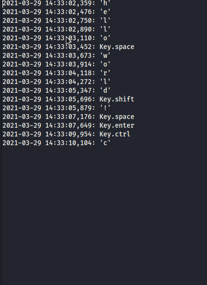

# keylogger
simple keylogger for linux/ubuntu with email sending
* You can pack the 3 pyhon files in archive then unzip it on the target and start the run.py file(python3 run.py)
* This file will move the all files linux/ubuntu  /etc/ folder install the dependencies(python modules and linux postfix server) then start the keylogger and send all keystrokes on your email on your email in 300 ms.
* Soon I will make everything in one file.

